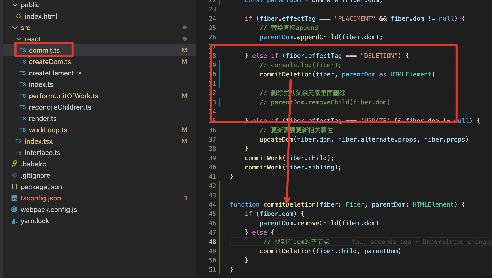

[toc]

这个离真正的react实现还差的远呢。 本文参考并简单实现 React 16.8 的基本功能。意在了解react基础知识和内部运作。
原文看着还是有点费劲，这里做了更详细的叙述和更细化的解构。

原文地址： https://pomb.us/build-your-own-react/

# 1、我们要实现什么

1. createElement
2. render
3. fiber
4. commit
5. diff协调
6. 函数组件支持
7. hook支持

# 2、jsx


1. babel天然支持jsx的转换，那么它被转换成了什么呢？[babel在线编译](https://www.babeljs.cn/repl#?browsers=defaults%2C%20not%20ie%2011%2C%20not%20ie_mob%2011&build=&builtIns=false&corejs=3.6&spec=false&loose=false&code_lz=DwEwlgbgfAjMD05pA&debug=false&forceAllTransforms=false&shippedProposals=false&circleciRepo=&evaluate=false&fileSize=false&timeTravel=false&sourceType=module&lineWrap=true&presets=env%2Creact%2Cstage-2&prettier=false&targets=&version=7.16.4&externalPlugins=&assumptions=%7B%7D)


2. react.createElement 又给转成什么了呢？


## 2.1 构建我们自己的 createElement
1. 参数分别是 `节点类型` `属性` `子节点集合` 
2. 所有节点都会调用 createElement 
3. 这也是构建我们自己的虚拟dom的过程
4. 代码如下


5. babel是默认找 当前环境的 react.createElement 去编译jsx的， 也可以通过注释的形式告诉它，替换成我们自己的


6. 我们自己的 createElement 转换后的结果


## 2.2 构建 render

1. 下面就是将我们自己的createElement 构建的虚拟dom 转换成真实dom并渲染到目标元素中了，代码如下

2. 渲染结果


 

# 3、思考

## 3.1 思考1：上面渲染的问题，方式上，性能上

a. 中间停不住，渲染过程会一直占用浏览器资源
b. 虚拟树很大的话，渲染没有结束之前，页面一直卡住，页面不可交互
c. 没有好的渲染时机，和浏览器其他任务抢占资源

## 3.2 思考2：如何优化？
a. 用fiber结构优化现在的虚拟dom，让每一个节点都可以找到它的父亲、孩子、兄弟，这样我们渲染得时候断点再续
b. 用requestIdleCallback来拿到浏览器的空闲时间


## 3.3 结论
我们需要个fiber结构，requestIdleCallback用来重复执行渲染fiber，并返回当前fiber的下一个要渲染fiber

# 4、 缔造我们的fiber

*  fiber 既是一种数据结构，也是一个工作单元
*  盗一张掘金的图


* 如何遍历fiber呢：（敲重点！！！）
  * A1
  * 找A1的child B1
  * B1有child，接着找B1得child C1
  * C1没有ciild, 找C1的 sibling C2
  * C2没有child, 没有sibling，返回C2的parent B1， 找B1的sibling B2
  * 如此循环
* 每个节点都保存着祖祖辈辈的节点信息，所以都知道如何找到下一个节点
* 所以就算中间停止了，还是能续命fi
* 接下来，就用代码实现这个过程

## 4.1 构建fiber

1. 首先看Fiber的类型定义


2. 新建一个文件  `performUnitOfWork.ts`，这里用来执行构建fiber，并返回下一个要渲染fiber，代码如下

```ts
import {Fiber} from '../interface';
import {createDom} from './createDom';

export function performUnitOfWork(fiber: Fiber) {
    if (!fiber.dom) {
        fiber.dom = createDom(fiber)
    }

    if (fiber.parent) {
        fiber.parent.dom.appendChild(fiber.dom)
    }
    let index = 0;
    const elements = fiber.props.children;
    // 用来记录上个fiber
    let preSibling: Fiber = null;
    // 构建子孙fiber
    while (index < elements.length) {
        const element = elements[index];
        const newFiber: Fiber = {
            type: element.type,
            props: element.props,
            dom: null,
            parent: fiber,
            child: null,
            sibling: null,
        }
        // 第一个作为孩子
        // 其他的作为上一个fiber节点的兄弟
        if (index === 0) {
            fiber.child = newFiber;
        } else {
            preSibling.sibling = newFiber;
        }
        preSibling = newFiber;
        index++;
    }
    // 返回下一个fiber节点
    // 有 child 返回 child
    // 没child 返回 sibling
    // 没 child 没 sibling 返回父节点的sibling
    if (fiber.child) {
        return fiber.child;
    }
    let nextFiber = fiber;
    while (nextFiber) {
        if (nextFiber.sibling) {
            return nextFiber.sibling;
        }
        nextFiber = nextFiber.parent
    }
}
```

## 4.2 循环执行工作单元

1. 执行 performUnitOfWork 的条件：浏览器有空闲时间 且 有下一个工作单元
2. 改造主文件 index.ts， 添加 nextUnitOfWork 属性 来保存 下一个工作单元，并在初始化的时候，启动工作单元


3. 构建我们的workLoop，新建文件 workLoop.ts


4. 接下来就是渲染所有节点了，我们把创建 dom的逻辑抽到 createDom.ts 里面


5. 接下来在 performUnitOfWork.ts 里面添加 创建和添加dom的逻辑


6. 重构后的新的渲染结果


## 4.3 fiber前后对比


> 尤大大：如果我们可以把更新做得足够快的话，理论上就不需要时间分片了。React Fiber 本质上是为了解决 React 更新低效率的问题，不要期望 Fiber 能给你现有应用带来质的提升, 如果性能问题是自己造成的，自己的锅还是得自己背。

# 5、commit提交

虽然现在可以中断了，到那时中断的时候，会将此前已经构建得工作单元给渲染出来，用户看到的就是不完整的UI

怎莫做才能让，UI一次性渲染呢？

关键在于，工作单元什么时候没有了，这就是渲染的时机，代码逻辑和实现如下：

* 利用 `workLoop` 的一直重复工作，可即时获取是否还有 `myReact.nextUnitOfWork`

* 如果没了 我们从根节点开始一次性的递归构建

## 5.1 index.ts  MyReact 新增 wipRoot 用来保存根节点


## 5.2 performUnitOfWork.ts 注释dom添加逻辑


## 5.3 render.ts 新增根节点记录


## 5.4 新增 commit.ts 来 递归添加dom逻辑


## 5.5 workLoop 中 寻找 commit 时机 开始渲染


## 6、diff 协调 

目的： 减少真实 dom 操作次数

* 不自己手写的话，很难记住，上下的代码逻辑衔接，这里贴出一张整体运作图


* 所以 接下来 需要在 构建工作单元的地方 动刀子

## 6.1 新增 reconcileChildren.ts ， 并将fiber构建的逻辑从 performUnitOfWork.ts 抽到里面


## 6.2 diff前

1. Fiber类型定义 新增 `alternate` `effectTag` 分别用来保存旧fiber和记录当前fiber的操作


2. 根节点的fiber构建是我们手动做的， 所以为了记录根节点的旧fiber 我们需要声明一个全局变量记录  `class MyReact` 新增 `currentRoot`

3. 记录 `currentRoot` 的时机也不比纠结，在当前工作的根节点 `wiproot` 置空之前，记录一下即可，并再构建根节点fiber的时候，赋值给根节点的`alternate`


## 6.3 开始diff

* 再重申一遍，构建fiber是构建得children，children第一个元素是child, 其他的是上一个fiber的sibling
* 所以先拿出旧fiber的child，后续接着取sibling，依次和新元素（VirtualDom）进行对比
* 类型相同 -> 只更新props -> effectTag: "UPDATE"
* 类型不同 且 有新元素 -> 被替换  -> effectTag: "PLACEMENT",
* 类型不同 且 有旧fiber -> 标记 oldFiber.effectTag = "DELETION" -> 添加到删除集合内，等待commit阶段统一删除


```ts
import {NodeProps} from './../interface';
import {Fiber} from '../interface';
import { myReact } from '.';

// 对比旧fiber 创建新fiber
export function reconcileChildren(wipFiber: Fiber, elements: NodeProps['children']) {
    let index = 0;
    let oldFiber = wipFiber.alternate && wipFiber.alternate.child;
    // 用来记录上个fiber
    let preSibling: Fiber = null;
    // 构建子孙fiber
    // 多个oldFiber 应为子元素有可能被删除了 需要构建 删除列表
    while (index < elements.length || oldFiber != null) {
        const element = elements[index];
        let newFiber: Fiber = null;
        const isSameType = oldFiber && element && oldFiber.type === element.type;
        // 类型相同 -> 只更新props
        if (isSameType) {
            newFiber = {
                type: oldFiber.type,
                props: element.props,
                dom: oldFiber.dom,
                parent: wipFiber,
                alternate: oldFiber,
                effectTag: "UPDATE",
                child: null,  // 后续根据 index 添加
                sibling: null, // 后续根据 index 添加
            }
        }
        // 类型不同 且 有新元素 -> 被替换
        if (!isSameType && element) {
            newFiber = {
                type: element.type,
                props: element.props,
                dom: null,
                parent: wipFiber,
                alternate: null,  // 被替换的fiber 没有旧fiber
                effectTag: "PLACEMENT",
                child: null,  // 后续根据 index 添加
                sibling: null, // 后续根据 index 添加
            }
        }
        // 类型不同 但是 有旧 fiber -> 被删除了
        // 这里不必担心位置，因为不是数组，只需要专心做新fiber的构建
        // 需保存被删除的fiber 找时机一次性从父元素删除即可
        if (!isSameType && oldFiber) {
            oldFiber.effectTag = "DELETION"
            myReact.deletions.push(oldFiber)
            // console.log(myReact.deletions, oldFiber, element);
        }     
        // 这句话狠重要，喵的 找半天bug
        // 对比一定要同步。。
        if (oldFiber) {
            oldFiber = oldFiber.sibling
        }   
        // 如果是更新 所有的
        if (index === 0) {
            wipFiber.child = newFiber;
        // 可能oldFiber 会导致 再次循环 有没有子元素 所以要要加个判断 element
        } else if (element) {
            preSibling.sibling = newFiber;
        }
        preSibling = newFiber;
        index++;
    }
}

```


## 6.4 commit改造

1. 以前fiber进入commit， 只要有fiber 就立即 拿 parent 做往parent添加dom的操作

2. 现在需要对不同的 effectTag 分别处理

  a. PLACEMENT 直接增加

  b. DELETION 批量删除

  c. UPDATE 更新dom


## 6.5 新增事件注册

* 在 updateDom里面，更新属性的同时 更新事件

```ts
// 看下新旧属性值是否一样
const isNew = (prev: Fiber['props'], next: Fiber['props']) => (key: keyof NodeProps) => prev[key] !== next[key]

// 是否是事件， 我没定义那多props的属性类型， 这里就直接用了string类型
const isEvent = (key: string) => key.startsWith("on")
----------------------------------
----------------------------------
export function createDom (fiber: Fiber) {
    // 更新属性部分省略。。。
    
     // 删除旧的或者有变化的事件
    Object.keys(prevProps)
        .filter(isEvent)
        // 不在新props上 或者 不是新的
        .filter(key => !(key in nextProps) || isNew(prevProps, nextProps)(key as any))
        .forEach(name => {
            const eventType = name.toLowerCase().substring(2)
            dom.removeEventListener(
                eventType,
                prevProps[name]
            )
        })
    // 注册事件
    Object.keys(nextProps)
        .filter(isEvent)
        .filter(isNew(prevProps, nextProps))
        .forEach(name => {
            const eventType = name.toLowerCase().substring(2)
            dom.addEventListener(
                eventType,
                nextProps[name]
            )
        })
   
}
```


至此， 这样一段代码就可以经过diff 正常渲染了


# 7、函数组件

## 7.1 解剖函数组件

* 目前还不能使用函数组件，那么函数组件在构建fiber节点的的时候是什么呢？那么看下面这个函数组件写完， 报的什么错？


* 报错信息和打印的当前函数组件得fiber节点信息如下：


* 可推断出:
  * 对于函数组件，fiber type 是函数本身
  * 我们需要创建的节点是函数的返回值，意味着需要执行这个函数
  * 函数的参数是props
* 那么支持函数组件的关键就是处理 `fiber.type` 是 function 的情况

## 7.2  改造 performUnitOfWork

1. 需要对正常fiber和函数fiber分别处理


2. 这里最后再提醒，构建fiber的过程，是在构建当前fiber的 子节点集合，那对于函数fiber节点，子节点集合就是函数执行的结果

* 这里需要注意
  * 函数组件，type是自己本身，没办法创建dom
  * 暂且不管，先创建它的子fiber集合


3. 此时改完，console控制台会看到一个新的报错信息


4. 自己写到这的话，肯定也能猜出来报错原因了，函数fiber节点没有dom啊，所以它的子节点，在commit时候，往父亲节点append的时候出错了。

5. 那么对于函数类型FIber，它的子节点父亲应该是是谁呢，看下面结构
```ts
const test = (
    <div1>
        <A>  // function A() {return <divA></divA>}
            <B />  // function B() {return <divB></divB>}
        </A>
    </div1>
)

```
6. div1 的 child 是 A,  A的Child是divA,  divA的child是B， B的child是divB

7. 那commit阶段， divA的要插入的目标父亲节点也出来了，就是div1，也即是有dom的第一个祖先节点

8. 更改commit.ts


9. 最后删除dom也要变动，同样的思路，添加是不停的向上找到有dom的祖先节点，删除是不停向下找有dom的子节点



# 8、hook

> 接下来我们开始让函数组件变得有状态

## 8.1 新增 hookIndex wipFiber 用来保存当前工作单元和hook索引


## 8.2 fiber对象新增hooks来保存当前函数节点所有的hook


## 8.3 新增useState.ts

```ts
import {Hook} from './../interface';
import {myReact} from './index';

type Action<T> = Hook<T>['queue'][0];
export function useState<T>(initial: T): [T, (p: Action<T>) => void] {
    const oldHook = myReact?.wipFiber?.alternate?.hooks?.[myReact.hookIndex];
    const hook: Hook<T> = {
        state: oldHook ? oldHook.state : initial,
        queue: []
    }
    // 从旧的钩子队列中获取所有动作，然后将它们一一应用到新的钩子状态
    const actions = oldHook ? oldHook.queue : []
    actions.forEach(action => {
        hook.state = action(hook.state)
    })
    const setState = (action: Hook<T>['queue'][0]) => {
        // 将set动作推进同一个队列数组，等函数组件重新执行，执行动作并set到当前状态
        hook.queue.push(action)
        // 更新的关键在于构建下一个工作单元
        myReact.wipRoot = {
            ...myReact.currentRoot,
            dom: myReact.currentRoot.dom,
            props: myReact.currentRoot.props,
            alternate: myReact.currentRoot,
        }
        myReact.nextUnitOfWork = myReact.wipRoot;
        // 每次构建根节点工作单元时，需重置删除队列
        myReact.deletions = []
    }
    // 记录所有hook
    myReact.wipFiber.hooks.push(hook)
    myReact.hookIndex++
    return [
        hook.state,
        setState,
    ]
}
```
## 8.4 函数组件重新执行的时候，也是更新重置hooks列表和索引的时候


## 8.5 奉上流程图


至此这里已经实现了基本react的功能，代码实现虽然远不及react源码，但是实现思路已经神似了，剩下的就是在此基础上，丰富判断，丰富功能。
完结 撒花！

希望小伙伴们有所收获~

推荐阅读

[这可能是最通俗的 React Fiber(时间分片) 打开方式](https://juejin.cn/post/6844903975112671239#heading-9)

[走进React Fiber的世界](https://juejin.cn/post/6943896410987659277#heading-18)

[「react进阶」一文吃透react-hooks原理](https://juejin.cn/post/6944863057000529933#heading-26)

参考资料
https://pomb.us/build-your-own-react/

代码地址
https://github.com/liuxinya/my-react